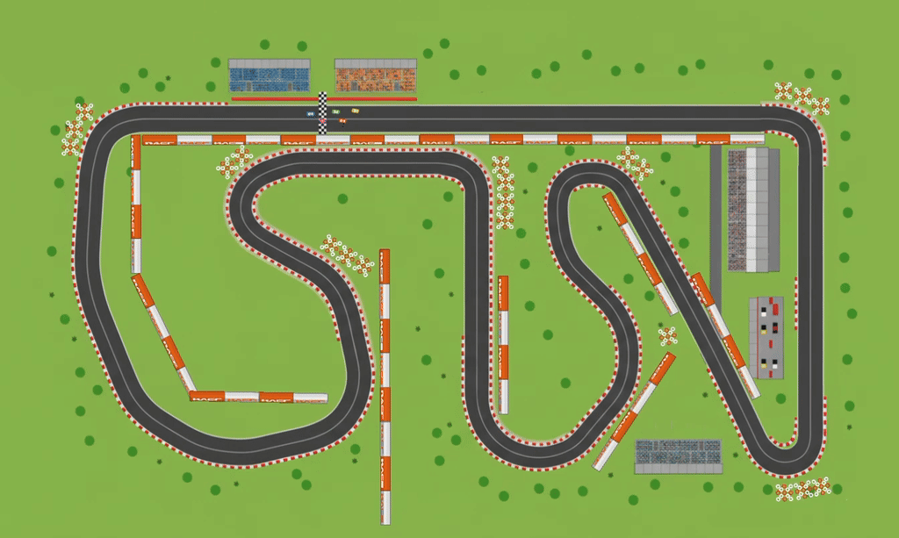
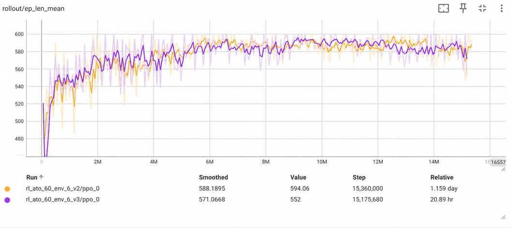
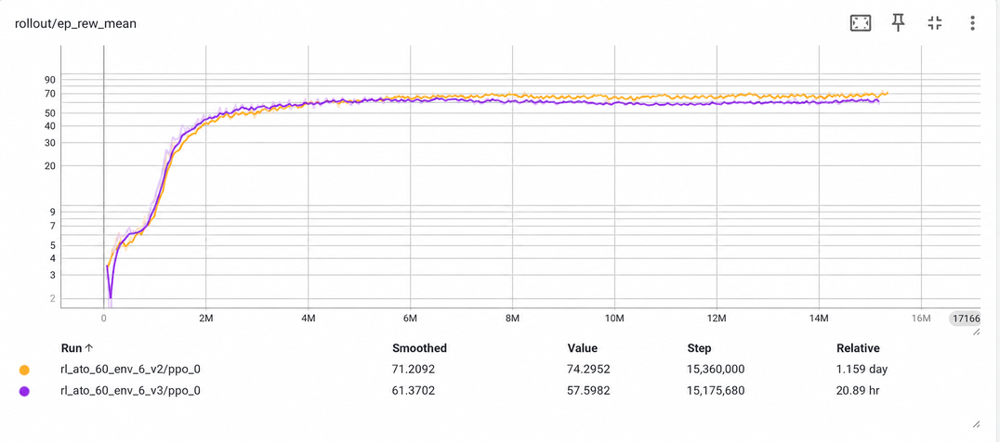

# Godot Race RL

Teach a car to race using reinforcement learning, inside a real game engine.

Godot Race RL is a top-down racing game built in Godot 4.7 that doubles as a Gymnasium environment for training RL agents. Godot runs the simulation, and a WebSocket bridge streams observations and rewards to a Stable-Baselines3 PPO trainer in Python. You can watch the agents learn to brake, drift and pick racing lines on a real track, drive against them yourself, or put several trained models on the grid to race each other.

- Godot as the simulator: the car physics is deterministic and scripted rather than rigid-body, and track, grass and barrier collisions come from the actual game scene.
Egocentric perception: raycast sensors and car-relative observations, so a policy learns to drive rather than memorising one track.
- Plug-and-play Python side: a uv-managed `rl/` package with training and inference CLIs, TensorBoard logs and rolling checkpoints.
- Still a playable game: two-player local racing (arrow keys and WASD) with drift, skid marks and tire barriers you can knock around.

The game code lives in `scenes/`, `scripts/` and `assets/`, and the RL layer lives in `scripts/rl/`, `scenes/rl/` and `rl/`. See [RL Layer](#rl-layer) to start training.




## Requirements

- Godot 4.7 (`/Applications/Games/Godot.app/Contents/MacOS/Godot` by default).
- GUT addon installed for automated tests (already included under `addons/`).
- For the RL layer: [`uv`](https://docs.astral.sh/uv/) (manages the Python side under `rl/`).


## Project Layout

- `scenes/`:
    - `track_base.tscn`: **The track itself** (track sprite, walls, tire/fence barriers) — edit the track here.
    - `main.tscn`: Human-play scene; instances `track_base.tscn` and adds player cars + camera.
    - `scenes/rl/rl_training.tscn`: RL training/inference scene; instances `track_base.tscn` and adds RL cars, checkpoint manager, WebSocket bridge.
    - `scenes/rl/`: Other RL training/inference scenes.
- `scripts/`: Gameplay logic.
    - `scripts/rl/`: RL observation/reward/episode/transport logic.
- `assets/`: Art, audio, UI resources.
- `tests/`: Automated specs, manual harness, playbook.
- `rl/`: Python side of the RL layer (`uv`-managed): Gymnasium environment, PPO training/inference CLIs.
    - RL Model defined here
    - `rl/checkpoints/{run-id}/`: rolling auto-saved training output, one subdir per run.
    - `rl/logs/{run-id}/`: tensorboard logs, one subdir per run.
    - `rl/saved_models/`: hand-picked checkpoints.
- `AGENTS.md`: Repo automation notes and guardrails.


## Getting Started

1. Open the editor:
   ```bash
   godot --editor --path .
   ```
2. Launch the main scene for human-controlled cars (P1:Arrow keys. P2: WASD):
   ```bash
   godot --path .
   ```


## Physics

- **Kinematic, not rigid-body**: the car is a `CharacterBody2D` with no mass or tire forces. Motion is scripted each tick and applied with `move_and_slide()`, keeping it deterministic for RL.
- **Speed & steering**: scalar speed with `acceleration`, braking and `friction`, capped at `max_speed`. Turning uses a kinematic Ackermann model (`wheel_base`).
- **Drift & surfaces**: velocity blends toward the heading (`drift_factor`); hard steering at speed causes a skid. Grass, detected from track pixel color, slows the car.
- **Collisions**: scripted bounces off walls and cars. Tire barriers are the only `RigidBody2D`s; the car pushes them with an impulse.


## RL Layer

Train a PPO agent to drive via a WebSocket bridge (`scripts/rl/rl_bridge.gd`) to a
Gymnasium/Stable-Baselines3 `VecEnv` (`rl/env.py`).

**Multi-car training.** Every car under `scenes/rl/rl_training.tscn`'s `Cars` node
is driven by the one policy currently being trained, and their combined experience
feeds a single PPO rollout buffer (see `specs/archived/rl-multi-car/`).

**Parallel environments.** `./train.sh --num-envs=P` launches `P` independent
headless Godot processes (ports `9000..9000+P-1`, or starting from `--port`)
instead of one, each running the full scene. `GodotParallelVecEnv` (`rl/env.py`)
fans PPO's action batch out across all `P` processes and concatenates their
results, for `num_envs = P × N` cars total (`N` = cars per scene).

**Inference can mix models.** `inference.py` loads one model per car slot,
cycling the given checkpoint paths if there are fewer paths than cars — so a
single checkpoint drives every car (watching self-play), or pass `N` distinct
checkpoints to race different trained models against each other on the same
track.


### Quick Start

**Training**
```bash
cd rl
./train.sh --total-timesteps 20_000 --checkpoint-freq 5_000                        # launches Godot headless + trains, run-id = timestamp
./train.sh --run-id my_run --total-timesteps 20_000                                # checkpoints/my_run/, logs/my_run/
./train.sh --run-id my_run --resume --total-timesteps 500_000 --verbose            # resumes checkpoints/my_run/'s latest checkpoint
./train.sh --run-id new_run --initialize-from my_run --total-timesteps 500_000     # warm-starts new_run's weights from my_run, step count resets to 0
./train.sh --num-envs=8 --total-timesteps 5_000_000                                # 8 parallel Godot processes (see specs/parallel-training/)
```

**Inference**
```bash
cd rl
./inference.sh saved_models/ppo_model_01                     # launches Godot (visible) + drives
./inference.sh saved_models/ppo_model_01 --random-spawn --verbose    # same, but spawns at a random gate each episode
./inference.sh saved_models/ppo_model_01 saved_models/ppo_model_02  # Assign two models alternatingly to 5 cars

# Assign unique mode to each car with best models starting last
./inference.sh saved_models/ppo_model_01 \
               saved_models/ppo_model_02 \
               saved_models/ppo_model_03 \
               saved_models/ppo_model_04 \
               saved_models/ppo_model_05
```

During inference, press **Space** to manually trigger a random-gate respawn for every car on demand — handy for spot-checking driving quality without waiting for a heat to end.

**Monitoring training progress:**
- Console output already shows live stats (`ep_rew_mean`, `ep_len_mean`, `fps`, `explained_variance`, ...) every 2048 steps, printed directly by `train.py`'s `verbose=1` PPO model — no extra setup needed.
- For graphical curves, training logs to `./logs/{run-id}` (`tb_log_name="ppo_car"`).

 In a separate terminal:
```bash
cd rl
uv run tensorboard --logdir logs
```

Then open `http://localhost:6006`. `tensorboard` is already a declared dependency in `rl/pyproject.toml`.
- Checkpoints saved every `--checkpoint-freq` steps to `./checkpoints/{run-id}/ppo_<steps>.zip` double as progress snapshots — run `./inference.sh checkpoints/{run-id}/ppo_<steps>` on one periodically to actually watch the policy drive, not just read the numbers.





### Car Perception

Each RL car (`scenes/rl/car_rl.tscn`) uses a fully **egocentric** observation — every
quantity is expressed in the car's own local frame, never absolute world position or
heading, so a trained policy doesn't overfit to one track's coordinates (see
`specs/perception-egocentric/`). A car carries 20 `RayCast2D` nodes (`Ray-180`,
`Ray-135`, ... `Ray0`, ... `Ray135`, named after their angle relative to the car's
forward direction), all the same length (~600px), fanning out around the car. 

Every step, two readings are taken per ray, using two different techniques:
- **Wall raycast sensor**: A real physics raycast (`RayCast2D` collision query) along the ray, 0 = obstacle immediately, 1 = clear.
- **Grass ray marching**: Grass has no collider, so this reuses the same ray's direction/length but steps along it in fixed increments, sampling the track texture's pixel color at each point until grass or the ray end is found. 0 = grass immediately, 1 = clear tarmac.
- The same rays also double as an **opponent detector**: whichever `RayCast2D`s hit
  another car (not a wall/tire barrier) that step contribute a candidate opponent,
  making detection occlusion-aware for free (a car hidden behind a wall isn't
  "perceived").

Extraction logic lives in `scripts/rl/car_sensors.gd` — pure functions, no scene-tree
dependency: `get_ego_state`, `get_raycast_distances`, `get_grass_distances`,
`get_surface_scalar`, `get_opponent_observations`. `scripts/rl/rl_bridge.gd` collects
each car's rays (`_collect_rays`) and assembles the full 67-float observation vector per
car in `_build_car_obs_array` (see the layout comment directly above that function for
the authoritative index table):

```
[0-4]   ego-state: forward velocity, lateral velocity, angular velocity (yaw rate),
        last commanded steer, last commanded throttle/brake -- all in [-1, 1]
[5-24]  wall-raycast distances, Ray-180..Ray135 in ascending angle order, in [0, 1]
[25-44] grass-raycast distances, same ray order, in [0, 1]
[45]    surface scalar: 1.0 on tarmac, grass_speed_multiplier on grass, in [0, 1]
[46-66] k=3 nearest opponent cars (7 floats each, zero-filled if fewer than k are
        detected): presence flag, relative position (x, y), relative heading
        (cos, sin), relative velocity (x, y) -- all car-relative
```

On the Python side, `rl/env.py` defines the matching Gymnasium `observation_space`
(`OBS_SIZE`, `OPPONENT_COUNT`) that the PPO policy trains against — kept in sync with
`rl_bridge.gd`'s layout by hand, not generated from one source.

**Decision frequency.** `scripts/rl/rl_bridge.gd`'s `ACTION_REPEAT_TICKS` (default 6)
holds each action across that many physics ticks (~0.1s at 60Hz) before asking the
client for the next one, so the policy decides at ~10Hz instead of every physics tick;
reward across the held ticks is averaged. Training-only — inference already runs
non-blocking and is unaffected.

**Observation stacking.** `train.py`/`inference.py` wrap the env in Stable-Baselines3's
own `VecFrameStack(n_stack=OBSERVATION_STACK)` (`rl/env.py`, default 3), so the policy
sees the last few frames concatenated rather than a single instant — no Godot-side or
wire-protocol change. A checkpoint trained with one `OBSERVATION_STACK` value expects
that exact stacked input size at inference time.


### Reward Shaping

`scripts/rl/rl_bridge.gd` calls `RewardCalculator.compute(...)` once per car per step; the function itself (`scripts/rl/reward_calculator.gd`) is pure, so tune the reward by editing only it. Per step, it sums:

- **Speed** — `speed_ratio * 0.1`. Driving forward, `speed_ratio` is `speed / max_speed` clamped to `[0, 1]`; reversing only pays half as much (`REVERSE_PENALTY_FACTOR = 0.5`). It used to pay the same in both directions, which let cars farm the dense speed reward by reversing instead of learning to corner toward the sparser checkpoint reward below.
- **Checkpoint progress** — `checkpoint_reward`, an event-based bonus accumulated in `scripts/rl/checkpoint_manager.gd` and consumed once per step (`consume_checkpoint_reward`): `reward_per_checkpoint` (default `5.0`) per gate passed in order, plus `lap_bonus` (default `50.0`) on lap completion.
- **Grass penalty** — `-0.05` per step while `is_on_grass` is true.
- **Collision penalty** — `-1.0` on any step with `had_collision_this_frame`.
- **Time penalty** — a flat `-0.001` every step, nudging the policy toward finishing laps quickly rather than idling.
- **Race position** — up to `RACE_POSITION_WEIGHT` (`0.02`), linear from last place (0) to first place (full bonus); `_compute_ranks()` sorts every car by `CheckpointManager.progress_score()` (`lap_count * gate_count + race_progress`, where `race_progress` only advances on legitimate gate crossings) and assigns 1...N by descending score, ties keeping car-slot order. A mid-episode respawn (stuck/grass recovery) teleports the car for gate-detection purposes only and does not grant or erase ranking credit.


## Tests

Run the automated suite with:
```bash
tests/run_gut.sh
```
This wraps the Godot Unit Test (GUT) command line runner (`res://addons/gut/gut_cmdln.gd`) targeting the specs in `tests/`.

For feel/UX checks, validate manually in-editor against `scenes/main.tscn` and describe steps/observations in the pull request — see `tests/README.md` for the full testing playbook and conventions.
